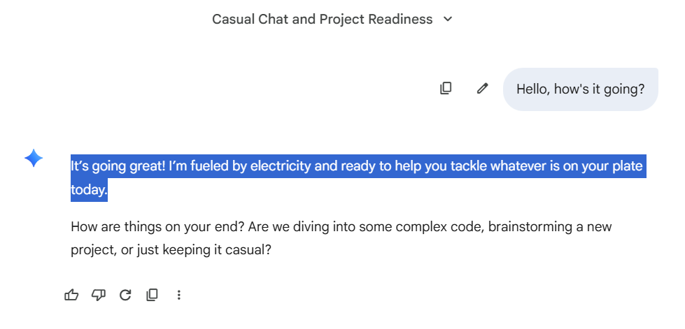
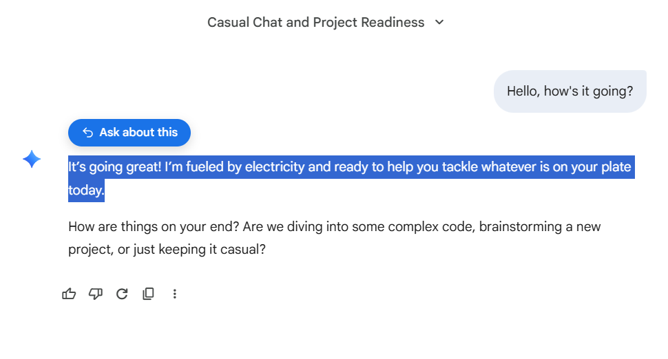
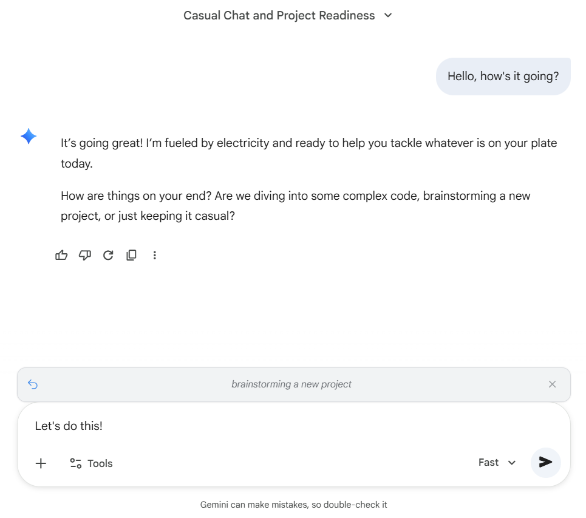
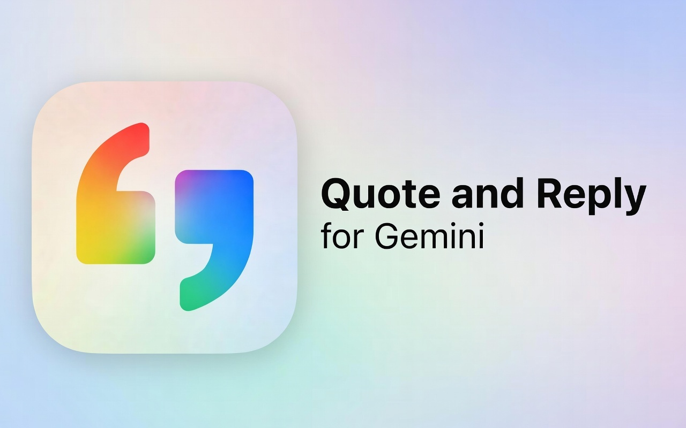

# Quote & Reply for Google Gemini

### Select any text in Gemini's responses and reply with automatic context. Makes follow-up questions clearer and more specific.

## Installation

[Context Reply for Gemini on the Chrome Web Store](https://chromewebstore.google.com/detail/context-reply-for-gemini/afhcldemoeopplcepdhggglfdebkapfo)

## Features

As of January 29, 2026, [Google Gemini](https://gemini.google.com/) does not support highlighting text from Gemini and clicking a button to be able to refer to certain portions of text from Gemini's reply. 

This extension fixes that with a native-feeling workflow allowing users to reply to specific portions of Gemini's text and cleanly see their replies throughout the chat history.

### Before:

### After:

